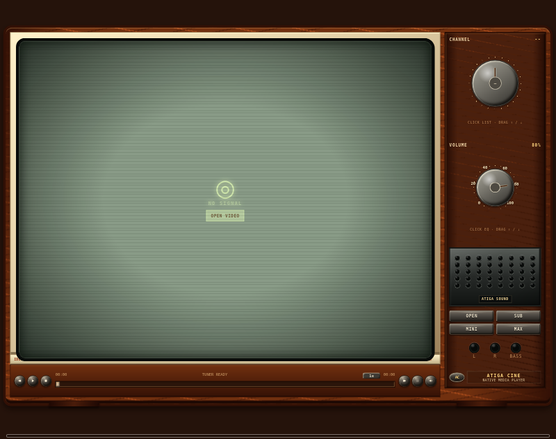
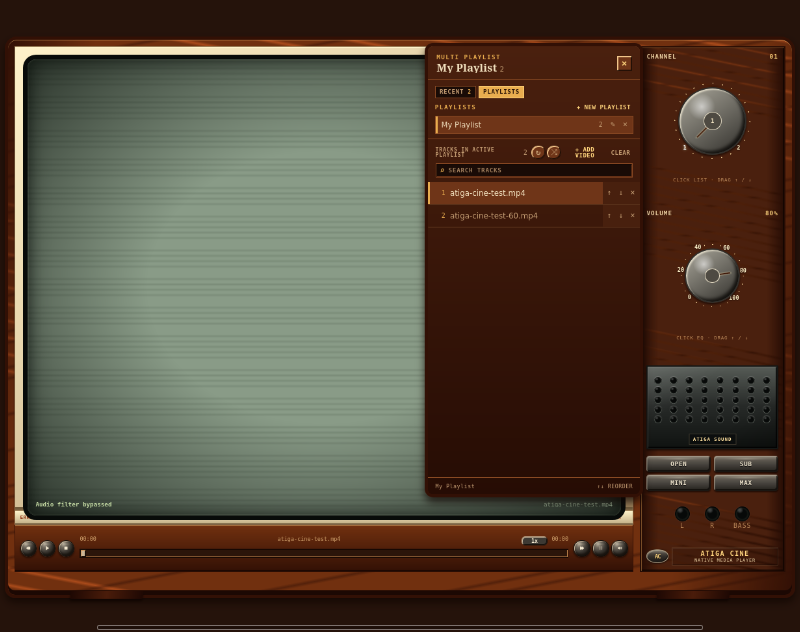
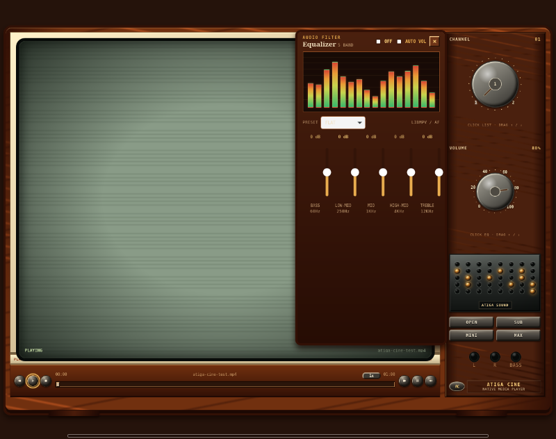

# Atiga Cine

[](LICENSE)

Atiga Cine — Native Media Player with a vintage TV interface.

Atiga Cine is a Linux desktop media player built with Tauri, Rust, Svelte, and libmpv. It combines native playback with a retro television interface designed for local video files.

> **Status: Beta.** Atiga Cine is an early release. Native playback is implemented, but the application has not been exhaustively tested across every Linux distribution, codec, GPU, or low-spec hardware profile.

## Preview

| Main view | Playlist drawer |
| --- | --- |
|  |  |

| Equalizer | Native playback |
| --- | --- |
|  |  |

## Features

- Native local playback through libmpv in the Tauri desktop application.
- Play, pause, stop, previous, next, seek, volume, mute, fullscreen, buffering, and end-of-file handling.
- Multi-playlist support with playlist creation, rename, delete, reorder, remove, clear, and session persistence.
- Virtualized playlist rendering and track search for larger playlists.
- Five-band equalizer at 60 Hz, 250 Hz, 1 kHz, 4 kHz, and 12 kHz.
- Equalizer presets for Flat, Bass Boost, and Vocal Boost, plus custom gain values from -12 dB to +12 dB.
- Optional loudness normalization through libmpv's `dynaudnorm` filter.
- External subtitle loading for `.ass`, `.srt`, `.ssa`, `.sub`, `.sup`, and `.vtt` files. Matching same-basename subtitles may also be detected by mpv.
- Playback-position resume for individual playlist items.
- Repeat modes for off, one, and all, plus playlist shuffle.
- Playback speed control from 0.5× to 2×.
- Drag and drop for supported video files and folders.
- Recent-files view with availability checks.
- Thumbnail previews while hovering over the seek bar.
- Native always-on-top mini player / PiP window with state restoration.
- Retro TV skin with optional CRT scanline and vignette effects.
- Supported video extensions include `.3gp`, `.avi`, `.flac`, `.m4v`, `.mkv`, `.mov`, `.mp4`, `.mpeg`, `.mpg`, `.ogg`, `.ogv`, `.ts`, `.webm`, and `.wmv`.

The equalizer bars are currently a procedural visualizer. They are UI feedback and do not represent measured real-time audio levels. Thumbnail previews, mini-player behavior, and performance on low-spec hardware should be treated as Beta until tested on the target machines.

## System requirements

### Runtime

- Linux with a WebKitGTK 4.1 / GTK runtime supported by Tauri v2.
- libmpv must be installed on the system for native playback and audio filters. The repository does not currently enforce or document a minimum libmpv version; use the version provided by your distribution and keep its runtime and development packages compatible.
- A working audio and video stack supported by libmpv.

On Debian or Ubuntu, the package names are commonly `libmpv2` for runtime playback and `libmpv-dev` for development. Package names differ between distributions, so check your distribution's package manager.

### Development

- Node.js 22.13 or newer.
- pnpm.
- Rust stable and Cargo.
- libmpv development headers and `pkg-config`.
- The Tauri Linux development dependencies for your distribution. For Debian or Ubuntu, Tauri documents `libwebkit2gtk-4.1-dev`, `build-essential`, `curl`, `wget`, `file`, `libxdo-dev`, `libssl-dev`, `libayatana-appindicator3-dev`, and `librsvg2-dev` as the standard prerequisites. See the [Tauri Linux prerequisites](https://v2.tauri.app/start/prerequisites/) guide for other distributions.

## Installation for users

Prebuilt AppImage, Debian, and other Linux packages will be available on the [GitHub Releases](../../releases) page when release packaging is finalized.

Until then, use the build-from-source instructions below. Native playback still requires libmpv to be installed on the system.

## Build from source

Install the Tauri dependencies and libmpv development package first. On Debian or Ubuntu, the following is a starting point:

```sh
sudo apt update
sudo apt install \
  libwebkit2gtk-4.1-dev \
  build-essential \
  curl \
  wget \
  file \
  libxdo-dev \
  libssl-dev \
  libayatana-appindicator3-dev \
  librsvg2-dev \
  pkg-config \
  libmpv-dev
```

Install Node.js 22.13 or newer, Rust stable, and pnpm, then clone and build the project:

```sh
git clone https://github.com/OWNER/atiga-cine.git
cd atiga-cine
pnpm install
pnpm tauri:dev
```

Replace `OWNER` with the GitHub account or organization that hosts this repository.

To create a release build:

```sh
pnpm tauri:build
```

Bundles are written under `src-tauri/target/release/bundle/`. The current project includes a local libmpv wrapper resource and sets `LD_LIBRARY_PATH` for the development command. Your system's libmpv installation is still required by the native playback integration.

Before opening a pull request, run the project checks:

```sh
pnpm verify
```

The browser preview can be started with `pnpm dev`, but it is only a UI preview. Native libmpv playback, subtitles, the native mini player, and native audio filters require the Tauri desktop runtime.

## Keyboard controls

| Key | Action |
| --- | --- |
| `Space` | Play / pause |
| `←` | Seek backward 5 seconds |
| `→` | Seek forward 5 seconds |
| `↑` | Increase volume by 5% |
| `↓` | Decrease volume by 5% |
| `F` | Toggle fullscreen |

The interface also provides buttons for opening media and subtitles, transport controls, playback speed, repeat, shuffle, equalizer, CRT, fullscreen, and mini-player actions.

## Contributing

Contributions are welcome. Please open an issue for larger changes before starting work, keep changes focused, run `pnpm verify`, and include a short description of the hardware or Linux distribution used for playback testing. Preserve the project's attribution and license notices when creating derivative work.

## License

Atiga Cine is licensed under the [Apache License 2.0](LICENSE).

Redistribution and derivative works must retain the original attribution and license notices, and modified files must carry a notice describing the change. See [NOTICE](NOTICE).

## Credits and acknowledgments

- [Tauri](https://tauri.app/) for the native desktop shell and application bundling.
- [libmpv](https://mpv.io/) and [`tauri-plugin-libmpv`](https://github.com/nini22P/tauri-plugin-libmpv) for native media playback and audio filtering.
- [Svelte](https://svelte.dev/) for the UI layer.
- [Vite](https://vite.dev/), [TypeScript](https://www.typescriptlang.org/), and Rust for the development toolchain.
